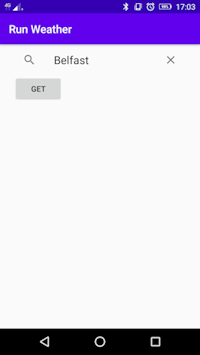
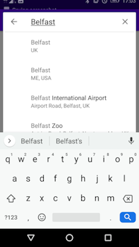
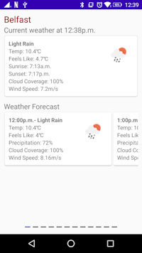

# Weather Run Helper

A lightweight Android app which will give you recommendations on the best time to go for a run and
 what conditions to expect for your location, along with a recommendation for what to wear.

## Installation

Clone this repository and import into Anroid Studio

```git
git clone git@github.com:louise652/android-weather-run-helper.git
```

To get the location picker, you will need to register with the Google Places api and get a key.
Follow [these instructions](https://developers.google.com/places/web-service/get-api-key) to do so and add the following line at the bottom of gradle.propertes

placesKey=YOUR_API_KEY


To connect to the openweatherAPI, ypu need to register and get a free api key, follow [these instructions.](https://openweathermap.org/appid)
Add the following line into the gradle.properties file.

weatherKey=YOUR_API_KEY

## Roadmap
This is the first iteration of the app and it is under construction subject to frequent code updates.

Future updates will include:
* Displaying the forecasted weather cards in a horizontal carousel so the user can swipe left/right between them
* Snapping the view to the card with the optimal weather conditions
* Adding in recommendations for what to wear for each timeslot
* Setting the background of each card to the weather condition
* Filters to refine the time range of results
* UI improvements for location selection

## Kanban Board
A Kanban board outlining future work and progress to date can be found [here](https://trello.com/b/GRX8n57o/weather-run-app)

## Screenshots
Screenshots of UI as of 12th September 2020. Images will be updated as UI changes are committed.





