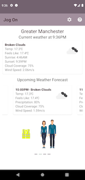

# Weather Run Helper

A lightweight Android app which will give you recommendations on the best time to go for a run and
 what conditions to expect for your location, along with a recommendation for what to wear.

## Installation

Clone this repository and import into Anroid Studio

```git
git clone git@github.com:louise652/android-weather-run-helper.git
```

To connect to the openweatherAPI, you need to register and get a free api key, follow [these instructions.](https://openweathermap.org/appid)
Add the following line into the gradle.properties file.

weatherKey=YOUR_API_KEY

## Kanban Board
A Kanban board outlining future work and progress to date can be found [here](https://trello.com/b/GRX8n57o/weather-run-app)

## Screenshots
Screenshots of UI as of 3rd July 2021. Images will be updated as UI changes are committed.



